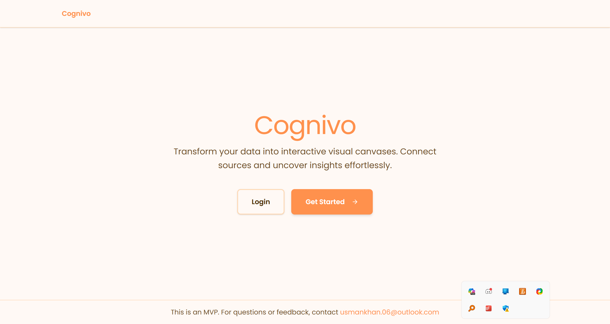
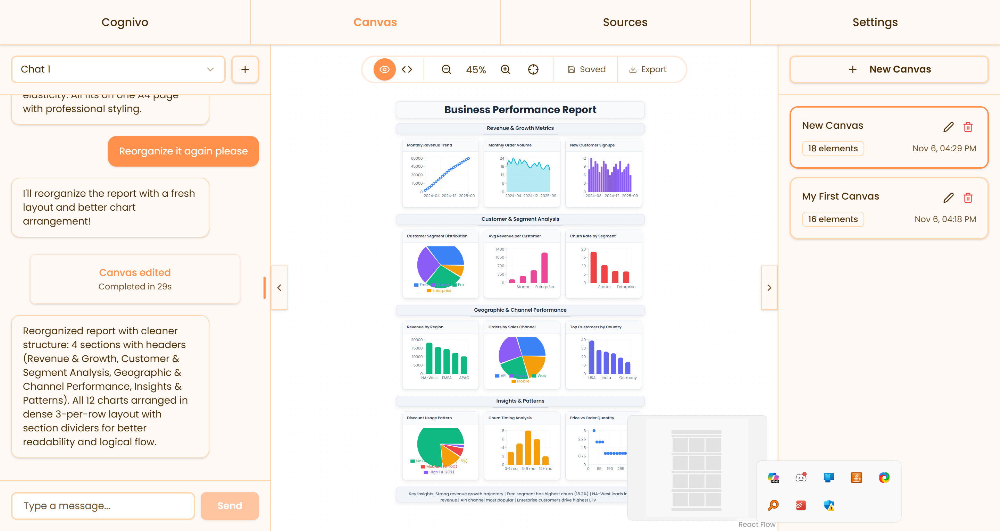

# 🎨 Cognivo - AI-Powered Data Visualization Platform

Transform your spreadsheets into intelligent, interactive visualizations using the power of Claude AI. Cognivo is a modern web platform that analyzes your data and automatically generates comprehensive dashboards with diverse charts.


## 📸 Screenshots

### Landing Page

*Clean, modern interface for data visualization*

### Interactive Dashboard

*AI-generated visualizations from uploaded CSV/Excel files*

## 🎥 Demo Video

[](./Media/demo.mp4)
*Watch how Cognivo transforms raw data into insights in seconds*

**Key Capabilities:**
- 🤖 **AI-Powered Analysis** - Claude intelligently analyzes your data structure and content
- 📊 **Auto-Generate Dashboards** - Creates 10-15+ diverse visualizations automatically
- 🎨 **Interactive Canvas** - Drag-and-drop interface for customizing your visualizations
- 💬 **AI Chat Assistant** - Ask questions about your data and get instant visual answers
- 📁 **Multi-Format Support** - Works with CSV, Excel (XLSX/XLS), and multiple sheets
- 💾 **Persistent Storage** - Your canvases and data are automatically saved

## ⚡ Quick Start

### Prerequisites

- Node.js 18+
- Python 3.9+
- Anthropic API Key ([Get one here](https://console.anthropic.com/settings/keys))

### Installation

```bash
# 1. Install dependencies
npm install
cd python-api && pip install -r requirements.txt && cd ..

# 2. Setup environment
copy .env.example .env
# Add your ANTHROPIC_API_KEY to .env

# 3. Run the application
npm run dev
```

Visit **http://localhost:3000** to start visualizing!

## 🛠 Tech Stack

**Frontend:** React 18, TypeScript, Vite, ReactFlow, Recharts, Radix UI, Tailwind CSS  
**Backend:** Node.js, Express, Python FastAPI, MongoDB, GridFS  
**AI:** Anthropic Claude (Haiku 4.5)

## 📊 How It Works

1. **Upload** - Drop your CSV/Excel file into the platform
2. **AI Analysis** - Claude AI analyzes columns, data types, relationships, and patterns
3. **Auto-Visualization** - System generates 10-15+ charts showing different perspectives
4. **Interact** - Chat with AI to modify visualizations or ask data questions
5. **Export** - Download your dashboard as PDF or individual charts

---

## 📁 Project Structure

```
Website/
├── src/                   # React frontend
│   ├── components/       # UI components
│   ├── db/              # Database layer (MongoDB + GridFS)
│   └── api/             # API clients
├── python-api/           # FastAPI backend
│   └── main.py          # AI processing server
├── api-server.js        # Express API server
└── mongodb-data/        # Local database (auto-created)
```

---

## ⚙️ Architecture

The project is divided into three main components that work together:

1. **Frontend (React + TypeScript)**
   - Modern UI built with React 18, TypeScript, and Vite
   - Interactive canvas using ReactFlow
   - Chart visualizations with Recharts
   - Runs on `http://localhost:3000`

2. **Backend API (Node.js + Express)**
   - Handles authentication, file management, and canvas operations
   - MongoDB hosted locally with GridFS for file storage
   - Runs on `http://localhost:3001`

3. **AI Service (Python + FastAPI)**
   - Processes data files and generates visualizations using Claude AI
   - Handles streaming chat responses with canvas editing
   - Runs on `http://localhost:8000`

All three services start simultaneously with `npm run dev`. 